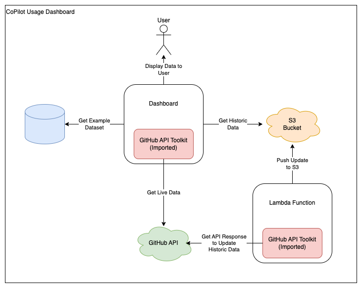

# GitHub Copilot Usage Dashboard

## Overview

This project contains an AWS Lambda Function which updates the GitHub Copilot dashboard's historic information, stored within an S3 bucket.

The Copilot dashboard can be found on the Copilot tab within the Digital Landscape.

[View the Digital Landscape's repository](https://github.com/ONS-Innovation/keh-digital-landscape).

## Techstack Overview

## Architecture Overview

This project uses 2 major components:

- The Lambda Function
- The GitHub API Toolkit (**stored in another repository** - [Repository Link](https://github.com/ONS-Innovation/github-api-package))

### The Lambda Function

This component updates the dashboard's historic information, stored within an S3 bucket. The lambda imports the GitHub API Toolkit to get the API response containing the usage information. The script then adds any new data to the existing historic data within the S3 bucket.

### The GitHub API Toolkit

This component is an imported library which is shared across multiple GitHub tools. The toolkit allows applications to make authenticated requests to the GitHub API. It is imported and used by both the dashboard and lambda function.

## High Level Data Overview

### Endpoint

 [View docs for the Copilot usage data endpoint](https://docs.github.com/en/rest/copilot/copilot-usage?apiVersion=2022-11-28#get-a-summary-of-copilot-usage-for-organization-members).

### Historic Data

This section gathers data from AWS S3. The Copilot usage endpoints have a limitation where they only return the last 28 days worth of information. To get around this, the project has an AWS Lambda function which runs weekly and stores data within an S3 bucket.

## Getting Started

To setup and use the project, please refer to the [README](https://github.com/ONS-Innovation/github-copilot-usage-lambda/blob/main/README.md).
